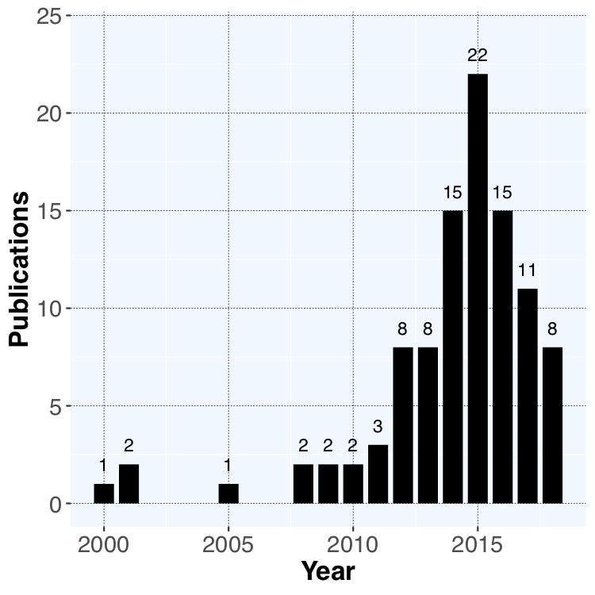

<link rel="stylesheet" href="https://use.fontawesome.com/releases/v5.0.10/css/all.css" integrity="sha384-+d0P83n9kaQMCwj8F4RJB66tzIwOKmrdb46+porD/OvrJ+37WqIM7UoBtwHO6Nlg" crossorigin="anonymous">

# Publications per year

  

 
A set of one hundred papers constitutes the attempt of researchers to tackle different challenges in designing elastic and efficient big data stream processing applications. As seen in the figure the first relevant publication came out in 2000. Then in 2012, the number of publications rose to a peak with 22 papers in 2015. After the peak, in the following two years, the number of publications fell. It is important to note that the data for the year 2018 is not complete, as we conduct the data search and export in August of 2018.

