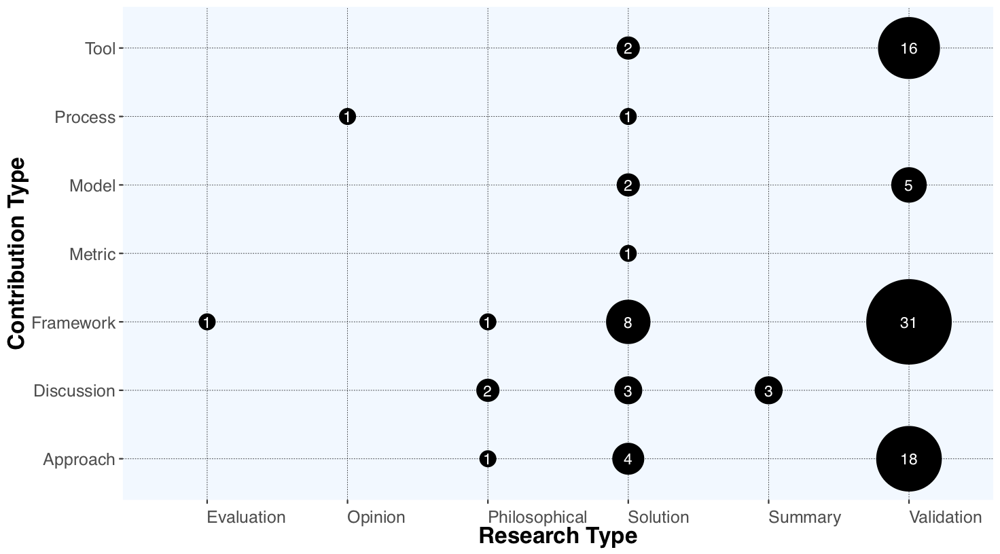

<link rel="stylesheet" href="https://use.fontawesome.com/releases/v5.0.10/css/all.css" integrity="sha384-+d0P83n9kaQMCwj8F4RJB66tzIwOKmrdb46+porD/OvrJ+37WqIM7UoBtwHO6Nlg" crossorigin="anonymous">

## Publications per year

  

 
A set of one hundred papers constitutes the attempt of researchers to tackle different challenges in designing elastic and efficient big data stream processing applications. As seen in the figure the first relevant publication came out in 2000. Then in 2012, the number of publications rose to a peak with 22 papers in 2015. After the peak, in the following two years, the number of publications fell. It is important to note that the data for the year 2018 is not complete, as we conduct the data search and export in August of 2018.

## Publications mapped to research and contribution type

  
    

 
As the figure depicts, the biggest gaps are in evaluations and opinions. Evaluation work need to evaluate the research in practice whereas opinions are usually formed after investigation of multiple different approaches. Both research types have a low number of works. Also other research categories—excluding validation research—have a low number

  

## Publications
<table>
  <tr><td>RT</td><td>CT</td><td>Publications</td><td>Num</td></tr>
  <tr><td>VAL</td><td>FRMW</td><td>(Gkolemis et al., 2017; Katsipoulakis et al., 2015; Wu and Tan, 2015; Gedik et al., 2018; Madsen and Zhou, 2013)</td><td>5/31</td></tr>
  <tr><td>VAL</td><td>APPR</td><td>(Cammert et al., 2008; Kombi et al., 2017; Isert and Schwan, 2000; Cervino et al., 2012b; Vasconcelos et al., 2016)</td><td>5/18</td></tr>
    <tr><td>VAL</td><td>TL</td><td>(Wu et al., 2017; Heinze et al., 2015; Zhang et al., 2013; Cardellini et al., 2018; Bellavista et al., 2013)</td><td>5/16</td></tr>
  <tr><td>VAL</td><td>MOD</td><td>(Mencagli, 2016; Heinze et al., 2014b; Nguyen et al., 2015; Lin et al., 2015; Qanbari et al., 2015)</td><td>5</td></tr>

</table>
<table>
    <tr><td>SOL</td><td>FRMW</td><td>(Vakali et al., 2016; Zhang et al., 2015; Bhandari, 2012; Chen et al., 2014; Zacheilas et al., 2016)</td><td>5/8</td></tr>
    <tr><td>SOL</td><td>APPR</td><td>(Das et al., 2014; Vu et al., 2010; Heinze, 2011; Humayoo et al., 2014)</td><td>4</td></tr>
    <tr><td>SOL</td><td>DISC</td><td>(Ahmed et al., 2016; Reale et al., 2014; Martin et al., 2014)</td><td>3</td></tr>
    <tr><td>SOL</td><td>TL</td><td>(Martins et al., 2014; HoseinyFarahabady et al., 2017)</td><td>2</td></tr>
    <tr><td>SOL</td><td>MOD</td><td>(Imai et al., 2016; Vulpe and Frincu, 2017)</td><td>2</td></tr>
    <tr><td>SOL</td><td>PROC</td><td>(Heinze et al., 2014c)</td><td>1</td></tr>
    <tr><td>SOL</td><td>MET</td><td>(Vorona et al., 2014)</td><td>1</td></tr>
</table>

<table>
    <tr><td>REV</td><td>DISC</td><td>(Heinze et al., 2014a; de Assuncao et al., 2018; Hummer et al., 2013)</td><td>3</td></tr>
</table>

<table>
      <tr><td>PHIL</td><td>DISC</td><td>(Eyers et al., 2012; Sun et al., 2015)</td><td>2</td></tr>
      <tr><td>PHIL</td><td>FRMW</td><td>(Hochreiner et al., 2015)</td><td>1</td></tr>
      <tr><td>PHIL</td><td>APPR</td><td>(Bustamante et al., 2001)</td><td>1</td></tr>
</table>

<table>
        <tr><td>OP</td><td>PROC</td><td>(Truong et al., 2016)</td><td>1</td></tr>
</table>

<table>
        <tr><td>EVAL</td><td>FRMW</td><td>(Chun et al., 2013)</td><td>1</td></tr>
</table>
